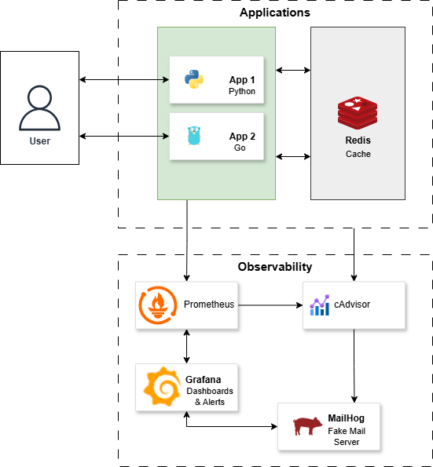

# 🚀 Microsserviços + Observabilidade + Cache

## 📖 Sobre o Projeto

Este projeto é uma **simulação prática de arquitetura de microsserviços**, combinando:

- Dois serviços independentes:
  - **app1** → Python (Flask)
  - **app2** → Go (net/http)
- **Redis** como camada de cache compartilhado
- **Observabilidade completa** com:
  - Prometheus (métricas)
  - Grafana (dashboards e alertas)
  - cAdvisor (infraestrutura/container metrics)
- **Sistema de alertas** com envio de notificações via **MailHog (SMTP fake)**

O objetivo é demonstrar, de forma prática, conceitos fundamentais de:

- Cache distribuído
- Instrumentação de aplicações
- Monitoramento (Golden Signals)
- Alerting (SRE mindset)
- Integração entre serviços via Docker Compose

---

## 🏗️ Arquitetura

  

### 🔎 Componentes

#### 🔹 Aplicações
- **app1 (Python/Flask)**
  - Endpoints `/time` e `/text`
  - Integração com Redis
  - Métricas via `prometheus_flask_exporter`

- **app2 (Go)**
  - Endpoints `/time` e `/text`
  - Middleware de métricas customizado
  - Integração com Redis

#### 🔹 Cache
- **Redis**
  - Armazena respostas dos endpoints
  - TTL configurável
  - Compartilhado entre serviços

#### 🔹 Observabilidade
- **Prometheus**
  - Scraping de métricas das aplicações
  - Query via PromQL

- **Grafana**
  - Dashboards automáticos (provisioning)
  - Alertas baseados em métricas

- **cAdvisor**
  - Métricas de containers (CPU, memória, rede)

- **Redis Exporter**
  - Métricas internas do Redis

#### 🔹 Alerting
- **Grafana Alerting**
  - Regras provisionadas via YAML

- **MailHog**
  - SMTP fake para testes locais
  - Interface web para visualizar alertas

---

## ⚙️ Funcionalidades

### 🔹 Endpoints

| Serviço | Endpoint | Descrição |
|--------|--------|----------|
| app1/app2 | `/time` | Retorna hora atual (com cache curto) |
| app1/app2 | `/text` | Retorna mensagem fixa (cache longo) |
| app1/app2 | `/metrics` | Métricas Prometheus |

---

### 🔹 Cache

- Cache Redis com:
  - TTL curto (`/time`)
  - TTL longo (`/text`)
- Métricas:
  - `cache_hits_total`
  - `cache_misses_total`

---

### 🔹 Observabilidade

#### Golden Signals implementados:

- Latência
- Throughput (RPS)
- Taxa de erro
- Saturação (CPU/memória)

---

### 🔹 Dashboards Grafana

- **Applications Overview**
- **Redis Cache Overview**
- **Containers Infrastructure Overview**

Provisionados automaticamente via arquivos JSON.

---

### 🔹 Alertas

Alertas configurados automaticamente na inicialização:

- 🔥 CPU alta (app1)
- 🧠 Memória alta (app2)

Envio via:
- 📧 Email (MailHog)

Interface MailHog: